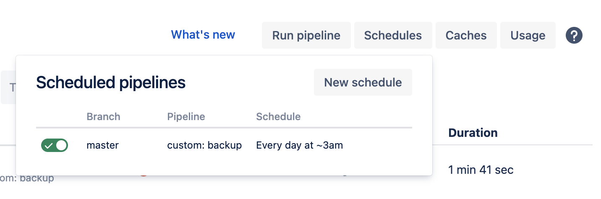

## blueways Deployer Recipes

This repository contains third party recipes that are build on top of [sourcebroker/deployer-extended-typo3](https://github.com/sourcebroker/deployer-extended-typo3).

## Install

~~~sh
composer require blueways/deployer-recipes
~~~

Include recipes in `deploy.php` file.

```php
require_once(__DIR__ . '/vendor/blueways/depyloer-recipes/autoload.php');
```

Note: As long as the [pull request](https://github.com/sourcebroker/deployer-extended/pull/13) that fixes local backups is not merged, this package needs to use a fork of `sourcebroker/deployer-extended@^16.0`. Add the fork to your main `composer.json`:

```json
{
   "repositories": [
      {
         "type": "git",
         "url": "https://github.com/maikschneider/deployer-extended"
      }
   ],
   "require": {
      "blueways/deployer-recipes": "^1.0",
      "sourcebroker/deployer-extended": "dev-hotfix/local-backup as 16.1.0"
   }
}
```

## Defaults

This package sets default values for various settings.

|Setting|Value
|-------|-----
|web_path|`public/`|
|shared_files|`.env`, `.htaccess`, `LocalConfiguration.php`, [AdditionalConfiguration.php](https://gist.github.com/jonaseberle/1ed3b12e645667f2e1228f091fcaaa20), `PackageStates.php`|
|file_backup_packages|`fileadmin`, `uploads` (excluding `_processed_` and `_temp_`)
|file_backup_keep|`1`


## Recipes

* `db:backup:rsync`
* `file:backup:rsync`

### db:backup:rsync

Rsync database backups to remote host.

### file:backup:rsync

Rsync file backups to remote host

## Settings

|Setting|Value
|---|---
|backup_storage_db_keep| `10`
|backup_storage_file_keep| `3`

## Examples

### Auto-Backup

1. Add a backup host in `deployer.php`: 

    ```php
    host('hidrive')
        ->hostname('username@hidrive.strato.com')
        ->set('deploy_path', '/home/backup/projectX')
        ->roles('backup_storage');
    ```

2. Add a custom pipeline in `bitbucket-pipeline.yml`:

    ```yaml
    definitions:
      steps:
        - step: &checkout-master
            name: Checkout master branch
            image: atlassian/default-image:2
            artifacts:
              - .git/**
            script:
              - git config remote.origin.fetch "+refs/heads/*:refs/remotes/origin/*"
              - git fetch origin
              - git checkout master
        - step: &install-deployer
            name: Install deployer
            image: composer:latest
            caches:
              - composer
            artifacts:
              - vendor/**
              - public/**
              - .env
            script:
              - composer install --no-ansi --no-interaction --no-progress --no-scripts --ignore-platform-reqs
              - mv .env.mittwald .env
    
    pipelines:
      custom:
        backup:
          - step: *checkout-master
          - step: *install-deployer
          - step:
              image: drud/ddev-webserver:v1.17.6
              name: Backup database and rsync to HiDrive
              script:
                - phpdismod xdebug
                - ./vendor/bin/dep db:backup production --no-interaction
                - ./vendor/bin/dep db:backup:rsync production --no-interaction
                - ./vendor/bin/dep file:backup production --no-interaction
                - ./vendor/bin/dep file:backup:rsync production --no-interaction
    ```
   
3. Register a new scheduler

    
